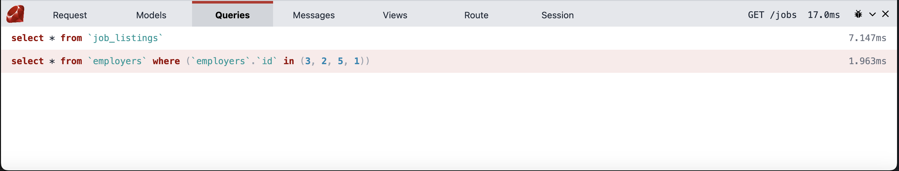

# Roda Debug Bar

The Roda debug bar is inspired by Laravel's debug bar. That project has 17k stars, so it's clearly something people appreciate. However, there isn't one for Roda.

I've made the design Ruby-themed as much as I can, down to using the official brand color `#cc342d`. It also plugs into Sequel and I plan to have it plug into Rodauth as well, once I'm more familiar with it.

While the debug bar is inspired by Laravel's, the code is based on adam12's enhanced logger for Roda, https://github.com/adam12/roda-enhanced_logger. It was an invaluable help in implementing the thread-safe code. It still has the `current.rb` and `instance.rb` files from the original project.



## Installation

Add this line to your application's Gemfile:

    gem "roda-debug_bar"

And then execute:

    $ bundle

Or install it yourself as:

    $ gem install roda-debug_bar

## Usage

For basic usage, simply enable through the `plugin` mechanism.


```ruby
class App < Roda
  plugin :debug_bar
end
```

## Naming

Just a quick note, as I found the naming convention weird the first time I saw it. The hyphen is used to denote that a gem belongs to, or extends another. For instance `rspec-rails` extends rspec with rails-specific features and `devise-jwt` adds jwt support to devise. The underscore is used to separate words when the name of the gem itself is more than one word as in `json_pure`.

In this case, the `-` in `roda-` signifies that it's a Roda plugin, whereas the `_` in `debug_bar` means that the name of the extension is "debug bar."

## Contributing

I'd love feedback! This project is young and still hasn't hit its first stable release (1.0.0 with SemVer). You can find me on the [Ruby Discord](https://discord.gg/gC83Q4Kq) as @AviFS.

## Versioning

This project uses [Semantic Versioning](https://semver.org) for version control.

## License

The gem is available as open source under the terms of the [MIT License](http://opensource.org/licenses/MIT).
