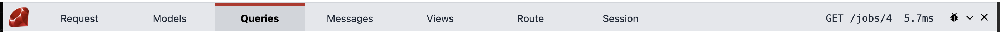

# Tabs

## Table of Contents
- [Header](#header)
- [Request](#request)
- [Models](#models)
- [Queries](#queries)
- [Messages](#messages)
- [Views](#views)
- [Route](#route)
- [Session](#session)
- [Other](#other)

## Header

This displays the official Ruby logo, the tabs as clickable elements, and then the right hand side.

The right hand side currently shows the request method and the path along with how long the response took. There is a bug icon, which when clicked, returns the full `@data` object generated for the request rendered as JSON.

The minimize and close icons are at the very right to hide the debug bar. Click the Ruby logo will also open/close the debug bar.

#### WIP Notes
The right hand side, rendered here as `GET /jobs/4 5.7ms` to the left of the bug icon, is open to change. The Laravel debug bar renders quite a bit more meta information, including the memory usage (not currently tracked), the PHP version, and two icons which seem to me to be different views of the last few requests you've made. (The Laravel bar does not have the bug, though. That's my own doing to make the `@data` object more accessible. The `@data` object contains everything scraped by the debug bar.)

There might be some coloring added to that right hand side, more information, etc. I also think the styling could use some work and that the header should be narrower, with smaller text.

## Request

Request info like the request method, path, params, status code, http version, and the request and response headers.

#### WIP Notes
I'd like to add a JSON expandable/collapsible tree view with syntax highlighting for some of the larger hashes, like env. I looked through a few javascript libraries, but I didn't like the styling in this context, so I might make my own. An expandable/collapsible tree viewer for hashes is high priority as one of the next features, and it would be used across most of the tabs.

## Models

The models that are used are displayed, with a count of how many models were used, and an expandable view showing the values for each model. Assumes the use of Ruby library Sequel.

#### WIP Notes
The syntax highlighting colors are fairly good, but the colors and styling were hand-picked for the "Queries" tab, and it could use some adjusting. Until I've got a nice, recursive, JSON tree viewer, the expanding and the syntax highlighting are done server side, and can only expand one level deep as shown above. Hashes within models can't be expanded.

## Queries

The SQL queries that were run are shown on the left, and how long they took on the right. Currently, an overview line is shown at the top saying how many statements were executed, and how long they took in total. Assumes the use of Ruby library Sequel.

## Messages

These are the messages that were logged from the app, instead of the console. There are three log levels: info, warn and error. You can log to them with `DebugBar::info`, `DebugBar::warn` and `DebugBar::err` (naming in the works). There is a consideration to have this catch anything that was output with `puts` or `p` as well, just to have this catch whatever's in the console.

## Views

Views shows the views, components and partials that were rendered, along with a little bubble showing how many of them were rendered. On the right is a link to open the corresponding view file in your editor.

#### WIP Notes
(It's currently hard-coded to open in VSCode, and you have to set `@app_root` to have it know where the project is located, but that's all easy to fix if there's interest.)

## Route

Routes displays a trace of the Roda handlers that were matched, as well as the line and file that matched it.

#### WIP Notes
The syntax highlighting and styles here needs some *serious* work.

## Session

The session tab currently displays just a placeholder, but can easily be modified in the future to display the session data if `plugin :session` is loaded.

## Other

The Laravel debug bar also has a "Timeline" tab, an "Exceptions" tab, a "Mails" tab and a "Gate" tab. Of these, the mails tab sounds useful and can be added in the future. The timeline tab sounds neat, and can certainly be implemented. And as for the exceptions and gate tab, I'm not sure what they do.

I'd also like to add a Rodauth tab to these tabs above, once I have a little more experience with it and know what I want. A Rodauth tab seems very useful, and it would finally be the whole stack -- or one step closer to it -- with Roda + Sequel + Rodauth. The Jeremy Evans debug bar!
